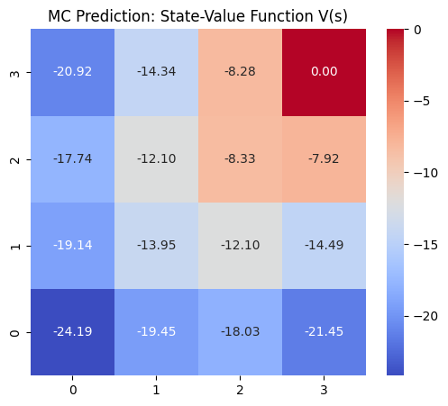
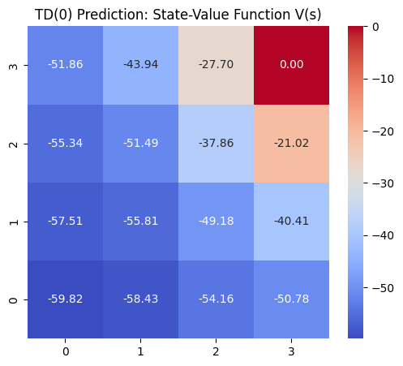
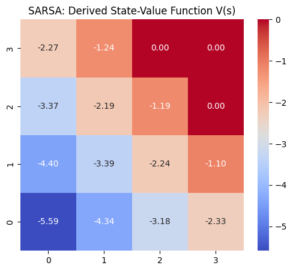
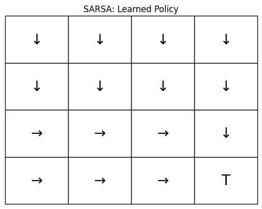
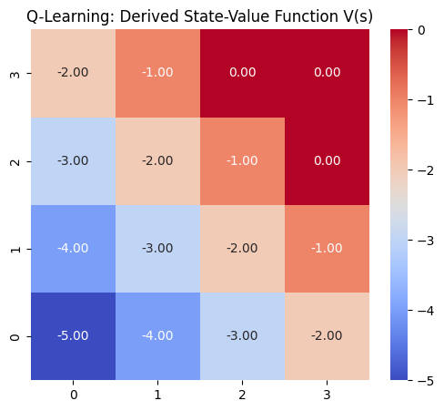
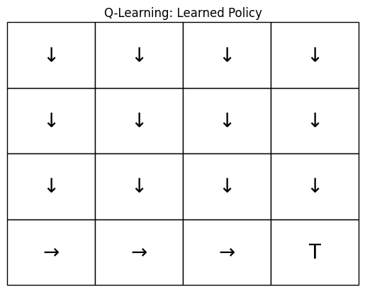

# Tabular RL Methods Comparison: Monte Carlo, TD(0), SARSA & Q-Learning


[](LICENSE)

This repository compares four foundational tabular reinforcement-learning algorithms in a small Grid World. It covers prediction (state-value estimation) and control (policy learning).

## 📌 Project Overview

**Notebook**: [`tabular_rl_gridworld_comparison.ipynb`](tabular_rl_gridworld_comparison.ipynb)

The implemented algorithms include:
1. **Monte Carlo Prediction**: First-visit MC to estimate the state-value function $V(s)$.
2. **TD(0) Prediction**: Temporal-Difference learning for continuous state-value updates.
3. **SARSA (On-Policy Control)**: TD-based method optimizing the policy that is actively being explored.
4. **Q-Learning (Off-Policy Control)**: TD-based method optimizing the greedy target policy regardless of exploration.

---

## 📊 Visualizations & Results

The notebook generates value heatmaps, learned-policy views, and reward curves from its configured runs. These outputs illustrate algorithm behavior in this environment; they are not multi-seed convergence benchmarks.

### Sample Outputs
<p align="center">
  
  
</p>
<p align="center">
  
  
</p>
<p align="center">
  
  
</p>

The visualizations include value-function heatmaps for MC versus TD and learned policies for SARSA versus Q-Learning.

---

## 🚀 Quickstart

```bash
git clone https://github.com/MSD-99/Tabular_RL_Methods_GridWorld.git
cd Tabular_RL_Methods_GridWorld
pip install -r requirements.txt
jupyter lab
```

Open `tabular_rl_gridworld_comparison.ipynb` and run the cells in order. No external dataset or pretrained model is required.

## License

Released under the [MIT License](LICENSE).
